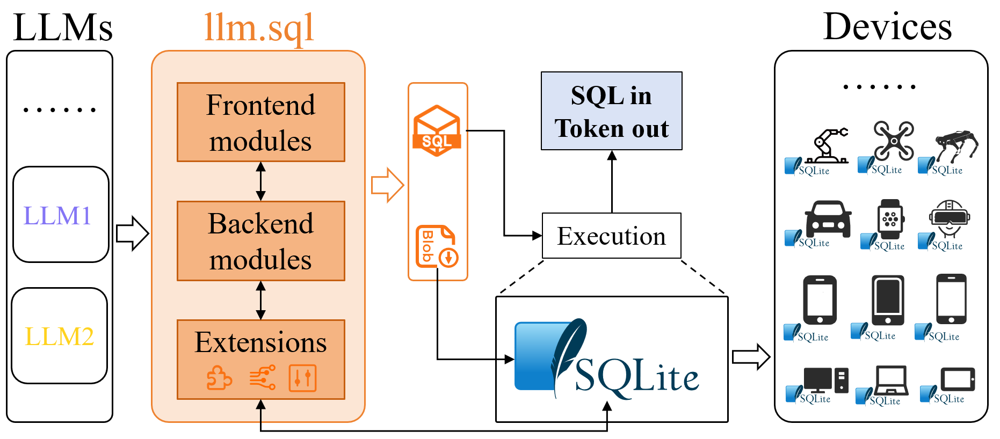
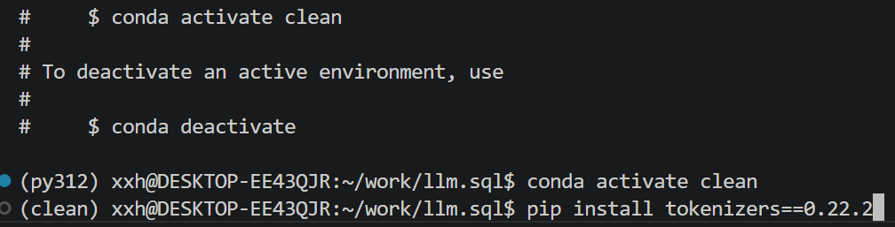
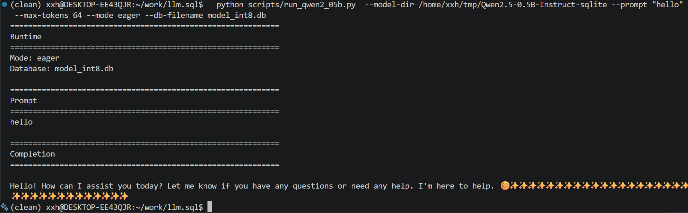
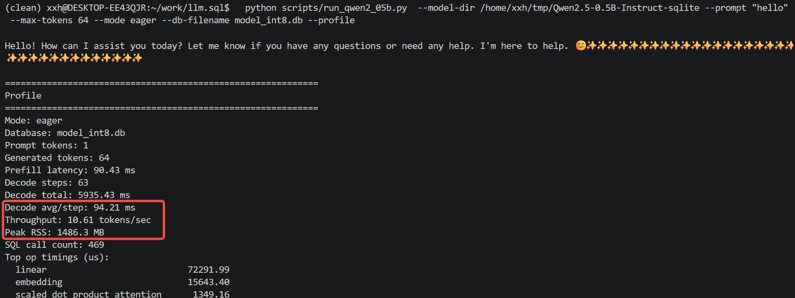
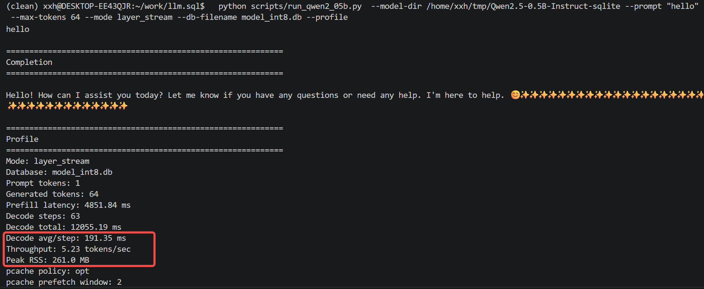
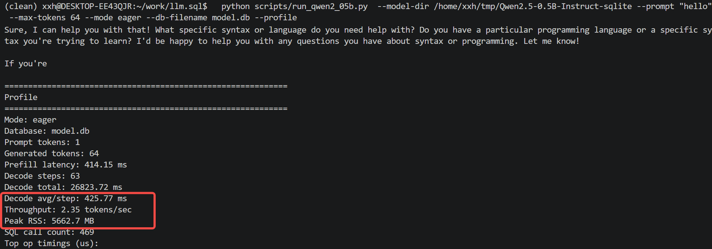
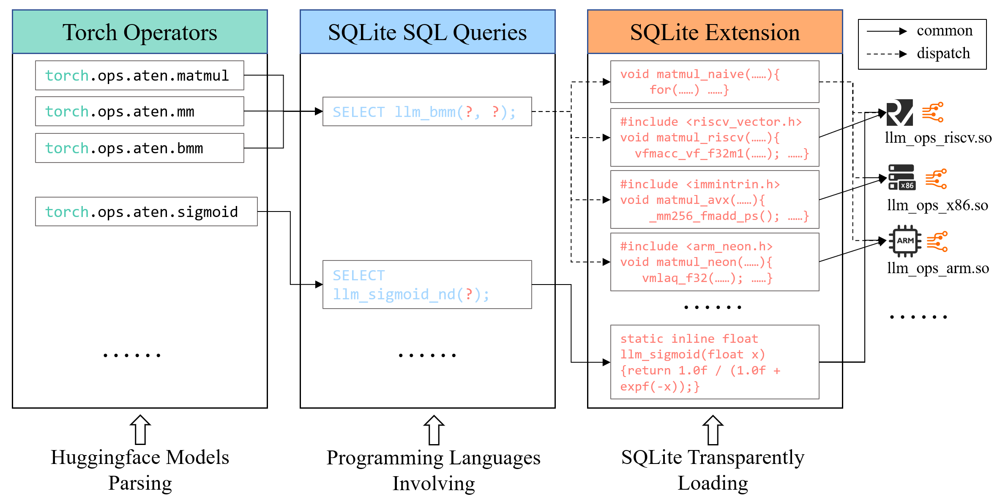
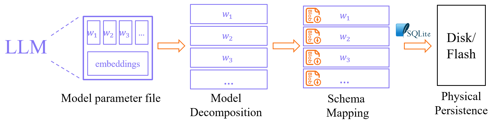
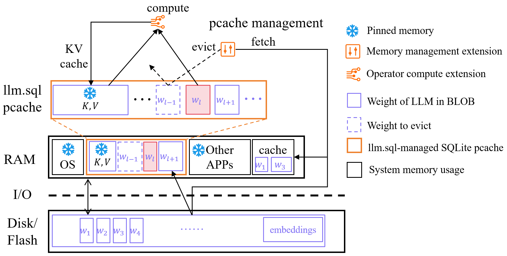

<!--
 * @Author: xuxianghong12
 * @Date: 2026-04-13 19:05:39
 * @LastEditors: xuxianghong12
 * @LastEditTime: 2026-04-25 12:27:20
 * @SPDX-License-Identifier: Apache-2.0
-->
# llm.sql

<p align="center">
  
</p>

<div align="center">
  <p>
    <a href="https://www.python.org/"></a>
    <a href="https://gcc.gnu.org/"></a>
    <a href="https://gcc.gnu.org/"></a>
    <a href="https://github.com/xuxianghong12/llm.sql/blob/main/LICENSE"></a>
    <a href="book/en/README.md"></a>
    <a href="book/zh/README.md"></a>
    
  </p>
</div>


> 


<h2 align="center">llm.sql: Bringing LLM Inference to Every Device</h2>

`llm.sql` is a brand-new LLM inference framework that reimagines the neural network execution pipeline as a series of structured SQL queries for SQLite. 


Specifically, in a single-process CPU-only inference setup, running Qwen2.5-0.5B-INT8 (model size ~**640MB**) decoding on llm.sql for a maximum of 64 tokens. The following programming languages maintain the peak memory usage (peak RSS) and decoding throughput as:
>
| Programming Language    | Peak RSS | Throughput       |
| ----------- | ----------- | -------------- |
| Python 3.12 | 260MB       | 5.23 tokens/s  |
| C11        | 210MB       | 7.40 tokens/s  |
| C++11      | 210MB       | 7.38 tokens/s  |
|       ...     |             |                |

## Background

This project stems from the following observations:
- **RAM Prices are Rising:** Memory has become much more expensive. In 2024, I purchased a 48GB DDR5 RAM kit (2x24GB) for approximately ¥800 (\$115). By early 2026, the same kit has surged to nearly ¥3,000 (\$429). This price hike has affected everything from flagship phones to IoT devices.
- **Limited RAM on Edge Devices:** Most edge devices are constrained by significantly smaller memory capacities. For instance, an iPhone 13 Pro is equipped with only 6GB of RAM. Furthermore, the memory bandwidth of edge devices is substantially lower than that of dedicated GPUs, creating a critical bottleneck for model execution.
- **The Edge LLM Paradox:** While edge LLMs like Gemma 4 (released April 2026) have gained significant traction, many users report app crashes.

**The Question:** How can LLMs work well on edge devices with limited RAM, especially when the OS and other apps are also active?

Therefore, this project was born out of personal curiosity about the memory cost of LLM inference on edge devices. 


## Design Principles
Most existing LLM inference frameworks are designed under the implicit assumption that memory is sufficient. However, this may not be true for edge devices in practice, as many active devices have insufficient idle memory to accommodate the full set of LLM parameters simultaneously. Besides, because of heterogeneous computing platforms, it is difficult for a single inference framework to cover all devices. Fortunately, [SQLite is already pre-installed on almost every platform/device in existence](https://sqlite.org/mostdeployed.html).

Therefore, `llm.sql` is a brand-new LLM inference framework designed around two core principles:
1. **Deterministic Memory Control of LLMs:** Manage memory bounds and swapping directly, avoiding the uncertainty of OS memory management. 
	- Memory Bound Management: Since the OS and other apps are always active on edge devices, uncontrolled LLM memory usage leads to frequent page faults and swapping. This degrades the performance of both the LLM and the entire system. 
	- Predictable Swapping Management: In Transformer-based models, the data and compute pipeline is deterministic. When computing the current layer, previous layers are no longer needed, and only the next layer's weights must be loaded. The memory access patterns of Transformer models are often the opposite of the LRU swap philosophy. Since the access pattern is fixed, Bélády's Algorithm (OPT) is feasible in this scenario.
2. **All-in-SQLite for Low Barrier:** The edge LLMs can be distributed, developed, and deployed easily within the universal SQLite ecosystem.
	- Unified Hardware. The SQLite ecosystem already runs on almost every device and platform. By building an inference engine on top of SQLite, we enable seamless LLM inference for all devices.
	- Unified Software. Any programming languages can perform LLM inference simply by connecting to SQLiteand executing the same SQL code, significantly reducing FFI learning and development costs.
	- Unified Storage/Memory. LLM weights are stored directly in SQLite tables. Take over memory management, implementing custom strategies such as Full Loading or Loading-on-Demand (Streaming), depending on memory usage restrictions.
	- Unified Compute. LLM operators are implemented via SQLite C extensions. Different hardware platforms load specific extensions for acceleration, while the process remains completely transparent to the user.


Designing an LLM inference framework around these two principles may involve some performance trade-offs. However, this approach significantly lowers the barrier and provides much-needed **determinism, stability, and controllability** for edge devices. The goal of `llm.sql` is to truly bring LLM capabilities to every device on the planet.


## Quick Start

The commands below are written for Linux and should be run from the repository root. (Verified on WSL Ubuntu-22.04)

### 1. Install the environment

Install the required system packages:

```bash
sudo apt update
sudo apt install -y build-essential pkg-config libsqlite3-dev
```

Create a conda environment and install the Python dependencies used by export and runtime scripts:

```bash
# create and activate a conda environment (Python 3.12 recommended)
# 
conda create -n llmsql python=3.12 -y
conda activate llmsql

# upgrade pip and install Python requirements
# ! These DL model dependencies are required by the model export procedure. 
# ! You can ignore and skip them if you just need the model inference.
pip install --upgrade pip
pip install -r requirements.txt
```

If you don't have Conda installed, [install Miniconda](https://docs.conda.io/en/latest/miniconda.html) and then run the commands above.


### 2. Build the SQLite extension

Build the SQLite extension before exporting or running inference. (Verified on GCC 11.4.0)

```bash
make -C sqlite-llm
```

### 3. Export Qwen2.5-0.5B-Instruct models
You can choose to export the models yourself or directly download the pre-exported versions.
#### Export models
The first export may download the model and tokenizer from HuggingFace. If you already have the model on disk, replace the model id with a local path.

```bash
EXPORT_DIR=/tmp/llm_sql_qwen2_05b

python scripts/export_qwen2_05b.py \
  --model Qwen/Qwen2.5-0.5B-Instruct \
  --output-dir "$EXPORT_DIR"
```

The export directory contains the runtime artifacts, including `model.db`, `model_int8.db`, `prefill.json`, `decode.json`, `prefill.native.json`, `decode.native.json`, `tokenizer.json`, and `manifest.json`.


> Exporting model parameters to SQLite BLOB tables requires about 5GB RAM for Qwen2.5-0.5B model.
> 
> If your computer is unable to export the model, you can directly download the pre-exported contents. 
> 
> Once `.db` and `.json` files are obtained, **no heavy Python dependencies are required for subsequent operations**. Only the `tokenizers` package is currently needed for BPE processing.

#### Download the pre-exported Qwen2.5-0.5B-Instruct models

Download all files from the [HuggingFace repository](https://huggingface.co/xuxianghong12/Qwen2.5-0.5B-Instruct-sqlite) and save them to your preferred location. These assets are required for performing LLM inference on `llm.sql`.

##### Option 1: Using git-lfs
You can download via [git-lfs](https://git-lfs.com/).

```bash
sudo apt update
sudo apt install git-lfs

git clone https://huggingface.co/xuxianghong12/Qwen2.5-0.5B-Instruct-sqlite
```
##### Option 2: Using HuggingFace CLI
Alternatively, use the official command.
```bash
hf download xuxianghong12/Qwen2.5-0.5B-Instruct-sqlite
```

> It is recommended to use the mirror by setting the environment variable for faster download. `export HF_ENDPOINT=your/mirror`

### 4. Run Qwen2.5-0.5B on llm.sql from Python

#### 🐍 Lightweight Environment Setup and Execution

> While the previous conda environment llmsql (conda activate llmsql) is applicable, this section demonstrates that the inference stage is entirely decoupled from heavy deep learning frameworks.

This step requires no deep learning dependencies such as PyTorch or Transformers. The Python interpreter simply executes SQL commands to perform full LLM inference. `tokenizers` package is required for BPE processing. 

```bash
# conda llmsql is also applicable
conda create -n clean python=3.12 -y
conda activate clean
pip install tokenizers==0.22.2
```
We plan to remove the tokenizers dependency in the future, achieving a pure, zero-dependency execution environment.

<p align="center">
  
  <br>
  <small>Create a lightweight python environment, only install tokenizers</small>
</p>


```bash
# path/to/exported/models
EXPORT_DIR=/tmp/Qwen2.5-0.5B-Instruct-sqlite 

python scripts/run_qwen2_05b.py \
  --model-dir "$EXPORT_DIR" \
  --prompt "hello" \
  --max-tokens 64 \
  --mode eager \
  --db-filename model_int8.db \
  --profile
```

This script prints the runtime mode, selected database, the input prompt, the generated completion, and optional profiling information.

#### Expected Results and Explaination
This section show some running command and their expected results.


##### Show the inference responce of Qwen-2.5-0.5B


```bash
# set the path
EXPORT_DIR=/tmp/Qwen2.5-0.5B-Instruct-sqlite 
python scripts/run_qwen2_05b.py  --model-dir "$EXPORT_DIR" --prompt "hello"  --max-tokens 64 --mode eager --db-filename model_int8.db
```

<p align="center">
  
  <br>
  <small>Show the response</small>
</p>


##### Show the profile in inference stage

As shown in the figure, `eager` mode (full-loading) occurs a peak RSS of **1,486.3MB** with **10.61 token/s**. 

```bash
# set the path
EXPORT_DIR=/tmp/Qwen2.5-0.5B-Instruct-sqlite 
python scripts/run_qwen2_05b.py  --model-dir "$EXPORT_DIR" --prompt "hello"  --max-tokens 64 --mode eager --db-filename model_int8.db --profile
```

<p align="center">
  
  <br>
  <small>Show the profile</small>
</p>


##### Model Parameter Loading-on-Demand

> This is a key function of llm.sql, which controls the memory usage in model inference.

As shown in the figure, `layer_stream` mode (Loading-on-Demand) occurs a peak RSS of **only 261.0MB** with **5.23 token/s**. 


⭐ Although throughput decreases **from 10.61 token/s to 5.23 token/s** compared to full-loading mode, `llm.sql`'s Streaming Loading Mode significantly reduces peak memory usage during the Qwen2.5-0.5B-INT8 inference stage from **1,486.3MB to just 261.0MB**.

Given that the parameters for Qwen2.5-0.5B-INT8 exceed 261 MB, this feature exemplifies a core design principle: llm.sql can controll the memory usage of the LLM inference process by loading sequence of model parameters.


```bash
# set the path
EXPORT_DIR=/tmp/Qwen2.5-0.5B-Instruct-sqlite 
python scripts/run_qwen2_05b.py  --model-dir "$EXPORT_DIR" --prompt "hello"  --max-tokens 64 --mode layer_stream --db-filename model_int8.db --profile
```
<p align="center">
  
  <br>
  <small>Show the profile of streaming loading mode</small>
</p>


##### FP32 vs int8
As shown in the figures, FP32 is significantly slower than INT8, demonstrating that the INT8 quantization effectively accelerates inference despite the current .db files occupying more storage space than their FP32 counterparts.

However, the current implementation serves primarily as a PoC, and there remains substantial room for efficiency gains. Future work will focus heavily on performance optimization to further bridge the gap between architectural potential and execution speed.

```bash
# set the path
EXPORT_DIR=/tmp/Qwen2.5-0.5B-Instruct-sqlite 
python scripts/run_qwen2_05b.py  --model-dir "$EXPORT_DIR" --prompt "hello"  --max-tokens 64 --mode eager --db-filename model.db --profile
```
<p align="center">
  
  <br>
  <small>Show the profile of streaming loading mode</small>
</p>


---

For the C and C++ demos, see [demo/README.md](demo/README.md).


## Features and Roadmap
See the documentation books: [English](book/en/README.md), [中文](book/zh/README.md).

The current development status and the long-term vision of `llm.sql` is shown as follows.


**Status Legend**
- ✅ Finished. 
- 🚀 Active.
- 🥚Incubating or Proof of Concept.
- 📅 Planned on the long-term horizon.


### Inference Engine (Unified Compute)


<p align="center">
  
  <br>
  <small>Roadmap of llm.sql Inference Engine</small>
</p>


The roadmap of the inference engine is shown in the figure. The inference engine is a high-performance C/C++ core that implements LLM inference operators in SQLite ecosystem. `llm.sql` transforms the complex LLM execution pipeline into a standardized workflow: (1) Huggingface models are decomposed into standard PyTorch aten operators. (2) Each PyTorch operator is mapped to a specific SQL template statement, transforming neural network inference into a series of structured SQL queries. These SQL-based LLM operations can be invoked by any programming language. (3) The underlying implementation of these SQL operators is ISA-aware. Depending on the hardware platform, the engine dynamically loads optimized C extensions (AVX, NEON, or RISC-V) to ensure peak performance across heterogeneous devices. The features and visions are:

- ✅ Baseline x86 Platform Support. Baseline implementation for standard x86_64 architectures.
- 📅 ISA-Level Optimization for x86 to improve the operator performance.
- 📅 Platform-Specific Acceleration. SIMD-optimized extensions (NEON for ARM, RVV for RISC-V) to support heterogeneous edge hardware.
- 📅 Computational Graph Optimization. Advanced operator fusion and more concise abstrctions to streamline the execution pipeline and facilitate easier usage for developers.
- 📅 More sub-byte quantization support (INT4 and below).
- 📅 Hardware Decoupling. Modular backends supporting transparent switching between different NPUs and GPUs. This is technically feasible due to the extensible and flexible design of `llm.sql`, which supports executing individual operators or bundling multiple operators into a "chunk" via complex SQL queries or define multi-operator commands in extensions.


### Storage Engine (Unified Storage)
<p align="center">
  
  <br>
  <small>Roadmap of llm.sql Storage Engine</small>
</p>

The roadmap of storage engine is shown in the figure. It focuses on leveraging SQLite's paging system to redefine how LLM weights and states are persisted. Weights-to-SQLite transformation pipeline: (1) Model Decomposition. The unified model parameter file of LLM is first unpacked into individual layer parameters. (2) Schema Mapping. Each layer's parameters are mapped as SQLite BLOB tables. (3) Physical Persistence. These tables are then serialized and persisted to Disk/Flash to storage, leveraging SQLite for management.

- ✅ Weights-in-SQLite. Store LLM parameters directly in SQLite BLOBs.
- 📅 All-in-One Distribution. Transitioning toward a fully self-contained, single-file architecture for seamless deployment.
- 📅 Fault-Tolerant Inference. Periodically persists the KV cache into the database during inference to prevent data loss from unexpected interruptions and enable seamless recovery.
- 📅 Task-specific KV cache. Persistent KV cache stored in tables, where the prefilling stage of preset tasks is pre-computed and stored.
- 📅 LoRA Management. Managing various domain-specific LoRA adapters for LLMs.
- 📅 Tokenizer in SQLite. Both the tokenizer and embeddings are persistently stored in database tables, allowing specific entries to be queried via primary keys and loaded into memory only when required.


### Memory Management
<p align="center">
  
  <br>
  <small>Roadmap of llm.sql Memory Management</small>
</p>


The roadmap of memory management is shown in the figure. This component is designed to replace the uncertainty of OS-level memory management with deterministic memory control, particularly in scenarios where RAM is limited.

- ✅ Full Parameter Loading. Loads the entire set of model parameter BLOB tables into memory at once when RAM capacity allows.
- ✅ Model Parameter Loading-on-Demand (Streaming Loading). Loads model layers into memory layer by layer to reduce the peak memory usage.
- 🥚 Pcache Upper Bounds Control. Precise management of SQLite's page cache limits to ensure predictable memory footprints for LLM states. 
- 📅 Bélády’s OPT Swap. The memory access patterns of Transformer models are often the opposite of the LRU philosophy. Implementing the optimal page replacement algorithm to minimize page misses during weight swapping, including proactive prefetching and strategic evicting.
- 📅 Tokenizer and Embedding Management. Load from storage when required to reduce memory costs.
- 📅 Multiple LLMs running management. Resource scheduling for concurrent model execution, featuring priority-based Swap-in and Eviction strategies to ensure stability when multiple LLMs compete for limited RAM.


### Programming Language Bindings
To enable seamless integration across diverse programming languages, `llm.sql` provides the following support:

- ✅ Python. Full support available, but only need `tokenizers`. 
- 🚀 We plan to remove the `tokenizers` dependency of Python.
- 🥚 C/C++. Currently in the Proof-of-Concept stage. 
  - In its current state, they handles raw Token IDs for both input and output. Direct support for natural language strings is planned for the next phase.
  - Integration of granular performance profiling to monitor execution metrics directly within the C/C++ runtime.
- 📅 Cross-Language Support. Native bindings for Go, Java, Rust, etc.


### Developer Experience & Observability
As a project born during a holiday, `llm.sql` has achieved its core functional goals, yet there remains significant room for refining the developer experience.

- 📅 More LLMs Support. While [Qwen2.5-0.5B-Instruct](https://huggingface.co/Qwen/Qwen2.5-0.5B-Instruct) is currently fully supported, the roadmap includes expanding compatibility to a broader range of architectures, ensuring the same deterministic execution across various model families.
- 📅 Streaming LLM Decoding Visualization. Implementation of real-time streaming interfaces, making the inference process as intuitive and visible as a typewriter.
- 📅 SQL-Native Prompt Templates. A built-in library of SQL functions to manage complex Prompt Templates, making the transition from "Raw Data" to "Model Input" a single SELECT statement away. For instance `SELECT llm_generate(prompt, max_token);`.
- 📅 User-Friendly Performance Profiling. Establishing intuitive performance dashboards to clearly visualize per-layer operator latency, memory swap frequency, and bottleneck identification.
- 📅 Trace & Debugging Tools. Providing enhanced logging and tracing utilities to help developers quickly locate model behaviors.


### Future Architecture & Research
`llm.sql`aims to become the default LLM inferene framework for edge devices, which may influence the future hardware, infrastructure, and model co-design:

- 📅 The Rise of [Matryoshka Representation Learning (MRL)](https://proceedings.neurips.cc/paper_files/paper/2022/file/c32319f4868da7613d78af9993100e42-Paper-Conference.pdf) in LLM. MRL-based models are suited for edge deployment. Leveraging `llm.sql`, these models can dynamically adjust to available resources and customized settings during inference. It is flexible enough to load different embedding dimensions, the number of active attention heads, or the total layers used for decoding.
- 📅The Foundation for Edge-Native Research. Providing a robust infrastructure for researchers to explore hot-swappable models, persistent KV cache, and other scenarios in resource-constrained environments.


## Inspiration
This project draws inspiration from the following publicly available research and projects:
- [TranSQL](https://openproceedings.org/2025/conf/edbt/paper-326.pdf) and [TranSQL+](https://arxiv.org/pdf/2502.02818). This series of research propose adapting LLM inference to databases. By leveraging DuckDB's built-in features (e.g., vector operations), they convert LLM inference tasks into DuckDB SQL execution. These pioneering works demonstrate the feasibility of using SQL engines for LLM inference. 
- [sqlite-ai](https://github.com/sqliteai/sqlite-ai). This industrial project shares a similar vision with TranSQL: performing LLM inference via SQL. It provides an abstraction of LLM interfaces within SQL and directly utilizes inference frameworks including `llama.cpp` to perform LLM tasks.
- [SQLite](https://sqlite.org/index.html). Arguably the most widely deployed data management software module in human history. As the "digital bedrock" of modern civilization, SQLite's unparalleled stability and ubiquity underpin the global data infrastructure. The goal of this project is to utilize SQLite to bring LLM capabilities to every device.
- [llama.cpp](https://github.com/ggml-org/llama.cpp). A highly optimized C/C++ framework designed for LLM inference with minimal dependencies. It enables running large models on consumer-grade hardware. `llm.sql` extends this "minimalist" philosophy by implementing LLM inference in the SQLite ecosystem.
- [Qwen Open-Source Models](https://huggingface.co/Qwen). The Qwen series, particularly the 0.5B small-parameter models, provided exceptional utility and convenience for testing and validation throughout the development of this project.