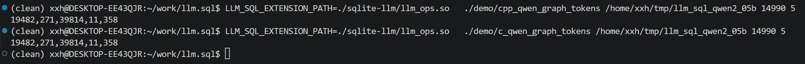

<!--
 * @Author: xuxianghong12
 * @Date: 2026-04-14 12:23:20
 * @LastEditors: xuxianghong12
 * @LastEditTime: 2026-04-16 20:33:41
 * @SPDX-License-Identifier: Apache-2.0
-->
# Demo: Run Qwen2.5-0.5B-Instruct on llm.sql from C and C++

This README is the verified demo path for Ubuntu-22.04.

Fixed inputs used below:

- model: `Qwen2.5-0.5B-Instruct`
- prompt: `hello`
- token id: 14990


The commands below are written for Linux and should be run from the repository root.

## 1. Build the SQLite extension

```bash
make -C sqlite-llm llm_ops.so
```

## 2. Export Qwen2.5-0.5B-Instruct
Refer to [README.md](../README.md) to export model yourself of directly download exported models.


## 3. Run Qwen on llm.sql from C and C++

Build both binaries:

```bash
make -C demo c_qwen_graph_tokens cpp_qwen_graph_tokens
```

Run the C demo with the verified `hello` token id (`14990`) and `max_tokens=5`:

```bash
LLM_SQL_EXTENSION_PATH=./sqlite-llm/llm_ops.so \
  ./demo/c_qwen_graph_tokens /path/to/exported/model 14990 5 model_int8.db
```

Run the C++ demo:

```bash
LLM_SQL_EXTENSION_PATH=./sqlite-llm/llm_ops.so \
  ./demo/cpp_qwen_graph_tokens /path/to/exported/model 14990 5 model_int8.db
```

Verified output for both commands:

```text
19482,271,39814,11,358
```

The same `5` token ids were also re-validated against the Python `StandaloneEngine` reference path. The output should appear as follows:

<p align="center">
  
  <br>
  <small>C/C++ Demo: Running Qwen-2.5-0.5B-Instruct on llm.sql</small>
</p>
